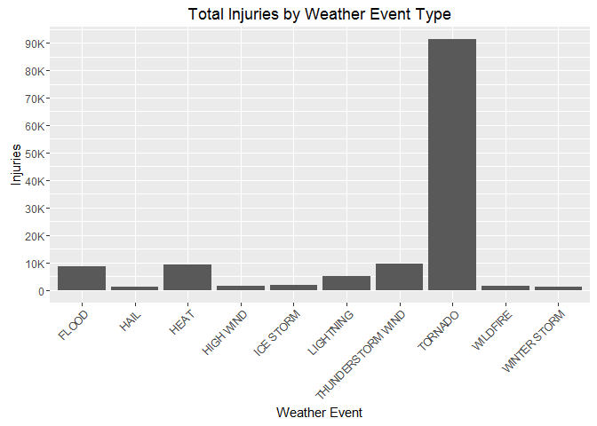

# National Weather Service storm data analysis of Human Health and Economic Impact
Gene Kaufman  
January 15, 2016  

# Synopsis
The data from the National Weather Service is comprised of storm data from 1950-2011. The data consisted solely of Tornado activity until 1955, and only 
Tornado, Thunderstorm Wind and Hail from 1955-1996. Since 1996, the data includes information on all storm types. However, the recorded event types differ 
greatly from the offically recognized event types in that there are numerous spelling and formatting errors, as well as many that are vague and ambiguous and 
don't map cleanly to a single official event type. A great effort has been made in this analysis to re-classify the event types as much as possible. Summarization 
of metrics per event type were performed, and the results show that Tornados have had the greatest impact on human health, while Hurricanes have had the greatest 
economic impact (specifically, property and crop damage).

# Data Processing
First, load some libraries and set some options

```r
require(knitr)
opts_chunk$set(echo=TRUE, results="asis", warning=FALSE, message=FALSE)

library(dplyr)
library(stringr)
```

Load the file into a data frame

```r
data_file_url<-"https://d396qusza40orc.cloudfront.net/repdata%2Fdata%2FStormData.csv.bz2"
data_file_local<-"storm.data.csv.bz2"
data_file_dir<-"data/"
if (!dir.exists(data_file_dir)) {
  dir.create(data_file_dir)
}
data_file_path<-paste0(data_file_dir,data_file_local)
if (!file.exists(data_file_path)) {
  download.file(data_file_url,data_file_path,mode = "wb")
}
# no need to unzip it - bz2 files can be read directly by read.csv and read.table
if (!exists("data_raw")) {
  data_raw <- read.csv(data_file_path)
}
```

### Prep Data for Analysis
Many entries for **EVTYPE**, **PROPDMGEXP** and **CROPDMGEXP** are duplicated with different cases, set all to upper case

```r
data_raw$EVTYPE <- as.factor(toupper(data_raw$EVTYPE))
data_raw$PROPDMGEXP <- as.factor(toupper(data_raw$PROPDMGEXP))
data_raw$CROPDMGEXP <- as.factor(toupper(data_raw$CROPDMGEXP))
```

Next, remove all extraneous fields, keeping only the ones that we'll need    
Population health:  
- **FATALITIES**, **INJURIES**  
Economic consequences:  
- **PROPDMG**, **CROPDMG** hold dollar amount  
- **PROPDMGEXP**, **CROPDMGEXP** hold character showing magnitude of PROPDMG/CROPDMG
  (i.e. "B","H")

```r
wanted_fields <- c("BGN_DATE","STATE","EVTYPE","FATALITIES","INJURIES",
                   "PROPDMG","PROPDMGEXP","CROPDMG","CROPDMGEXP")
data_raw_selected <- data_raw %>%
  select(one_of(wanted_fields))
```

Filter out records that have at least 1 FATALITY, 1 INJURY,
or at least $1 Property or Crop damage

```r
data_filtered <- data_raw_selected %>%
  filter(FATALITIES > 0 |
           INJURIES > 0 |
           PROPDMG > 0 |
           CROPDMG > 0)

# data_munged will hold the data as we're reducing the event types
data_munged <- data_filtered
```

Fix a data error in one record - this one was is mentioned in the record comments to be $115M, not $115B  
Credit: Robert Carman in the [Class Discussion forums](https://www.coursera.org/learn/reproducible-research/discussions/DrCe_bl7EeWjxw7W9fJX5Q)  

```r
data_munged$PROPDMGEXP[data_munged$PROPDMGEXP == 'B' & data_munged$BGN_DATE == '1/1/2006 0:00:00']<- as.factor("M")
```

### Data Munging: Event Type
**Strategy to clean up messy event types:**  
1. Attempt to reduce number of distinct events by removing non-letters, clean up spacing, expand abbreviations and fix obvious misspellings  
2. Explicitly replace events that are mentioned in the NWS documentation as being counted as another event  
3. Loop through official event list, replacing record events if the official event is a substring of the recorded event (e.g. "TORNADO F1" -> "TORNADO")  

```r
# some basic replacements to standardize some terms and misspellings
levels(data_munged$EVTYPE) <- gsub("  "," ",levels(data_munged$EVTYPE))
levels(data_munged$EVTYPE) <- gsub("\\\\","/",levels(data_munged$EVTYPE))
levels(data_munged$EVTYPE) <- gsub(" AND ","/",levels(data_munged$EVTYPE))
levels(data_munged$EVTYPE) <- gsub(" FLD$","",levels(data_munged$EVTYPE))
levels(data_munged$EVTYPE) <- gsub("/ ","/",levels(data_munged$EVTYPE))
levels(data_munged$EVTYPE) <- gsub("//","/",levels(data_munged$EVTYPE))
levels(data_munged$EVTYPE) <- gsub("/SML","/SMALL",levels(data_munged$EVTYPE))
levels(data_munged$EVTYPE) <- gsub("/SMALL"," SMALL",levels(data_munged$EVTYPE))
levels(data_munged$EVTYPE) <- gsub("AVALANCE","AVALANCHE",levels(data_munged$EVTYPE))
levels(data_munged$EVTYPE) <- gsub("COASTALSTORM","COASTAL STORM",levels(data_munged$EVTYPE))
levels(data_munged$EVTYPE) <- gsub("HVY","HEAVY",levels(data_munged$EVTYPE))
levels(data_munged$EVTYPE) <- gsub("ICE ON ROAD","ICY ROADS",levels(data_munged$EVTYPE))
levels(data_munged$EVTYPE) <- gsub("ICE ROADS","ICY ROADS",levels(data_munged$EVTYPE))
levels(data_munged$EVTYPE) <- gsub("BLACK ICE","ICY ROADS",levels(data_munged$EVTYPE))
levels(data_munged$EVTYPE) <- gsub("LAKE EFFECT","LAKE-EFFECT",levels(data_munged$EVTYPE))
levels(data_munged$EVTYPE) <- gsub("LIGHTING","LIGHTNING",levels(data_munged$EVTYPE))
levels(data_munged$EVTYPE) <- gsub("LIGNTNING","LIGHTNING",levels(data_munged$EVTYPE))
levels(data_munged$EVTYPE) <- gsub("PRECIP$","PRECIPITATION",levels(data_munged$EVTYPE))
levels(data_munged$EVTYPE) <- gsub("SQUALL$","SQUALLS",levels(data_munged$EVTYPE))
levels(data_munged$EVTYPE) <- gsub("THUDER","THUNDER",levels(data_munged$EVTYPE))
levels(data_munged$EVTYPE) <- gsub("THUNDEER","THUNDER",levels(data_munged$EVTYPE))
levels(data_munged$EVTYPE) <- gsub("THUNDERE","THUNDER",levels(data_munged$EVTYPE))
levels(data_munged$EVTYPE) <- gsub("THUNDERT","THUNDERS",levels(data_munged$EVTYPE))
levels(data_munged$EVTYPE) <- gsub("THUNER","THUNDER",levels(data_munged$EVTYPE))
levels(data_munged$EVTYPE) <- gsub("THUNDERTSORM","THUNDERSTORM",levels(data_munged$EVTYPE))
levels(data_munged$EVTYPE) <- gsub("THUNDERSORM","THUNDERSTORM",levels(data_munged$EVTYPE))
levels(data_munged$EVTYPE) <- gsub("TORNDAO","TORNADO",levels(data_munged$EVTYPE))
levels(data_munged$EVTYPE) <- gsub("TROM","TORM",levels(data_munged$EVTYPE))
levels(data_munged$EVTYPE) <- gsub("TSTM","THUNDERSTORM",levels(data_munged$EVTYPE))
levels(data_munged$EVTYPE) <- gsub("TUNDER","THUNDER",levels(data_munged$EVTYPE))
levels(data_munged$EVTYPE) <- gsub("UNSEASONABLE","UNSEASONABLY",levels(data_munged$EVTYPE))
levels(data_munged$EVTYPE) <- gsub("WINDCHILL","WIND CHILL",levels(data_munged$EVTYPE))
levels(data_munged$EVTYPE) <- gsub("WINDS","WIND",levels(data_munged$EVTYPE))
levels(data_munged$EVTYPE) <- gsub("COLD/WIND","COLD/WIND CHILL",levels(data_munged$EVTYPE))

# Special case - explicitly renamed in NWSI 10-1605
levels(data_munged$EVTYPE) <- gsub("LANDSLIDE","DEBRIS FLOW",levels(data_munged$EVTYPE))

# Special cases - explicitly mentioned in event type description in NWSI 10-1605
data_munged$EVTYPE[grepl("HYPOTHERMIA",data_munged$EVTYPE)]<-as.factor("COLD/WIND CHILL")
data_munged$EVTYPE[grepl("SLIDE",data_munged$EVTYPE)]<-as.factor("DEBRIS FLOW")
data_munged$EVTYPE[grepl("FREEZE",data_munged$EVTYPE)]<-as.factor("FROST/FREEZE")
levels(data_munged$EVTYPE) <- gsub("ASTRONOMICAL HIGH TIDE","STORM SURGE/TIDE",levels(data_munged$EVTYPE))
levels(data_munged$EVTYPE) <- gsub("HIGH TIDES","STORM SURGE/TIDE",levels(data_munged$EVTYPE))
levels(data_munged$EVTYPE) <- gsub("STORM SURGE","STORM SURGE/TIDE",levels(data_munged$EVTYPE))
levels(data_munged$EVTYPE) <- gsub("BEACH EROSION","HIGH SURF",levels(data_munged$EVTYPE))
data_munged$EVTYPE[grepl("SURF",data_munged$EVTYPE)]<-as.factor("HIGH SURF")
levels(data_munged$EVTYPE) <- gsub("DROWNING","RIP CURRENT",levels(data_munged$EVTYPE))
data_munged$EVTYPE[grepl("BURST",data_munged$EVTYPE)]<-as.factor("THUNDERSTORM WIND")
data_munged$EVTYPE[grepl("GUSTNADO",data_munged$EVTYPE)]<-as.factor("THUNDERSTORM WIND")
data_munged$EVTYPE[grepl("LANDSPOUT",data_munged$EVTYPE)]<-as.factor("TORNADO")
data_munged$EVTYPE[grepl("FIRE",data_munged$EVTYPE)]<-as.factor("WILDFIRE")
data_munged$EVTYPE[grepl("WINTRY",data_munged$EVTYPE)]<-as.factor("WINTER WEATHER")
data_munged$EVTYPE[grepl("DAM BREAK",data_munged$EVTYPE)]<-as.factor("FLASH FLOOD")

# temporarily rename MARINE THUNDERSTORM WIND to mtsw so that we don't lose it when
#   we replace THUNDERSTORM in a later step
levels(data_munged$EVTYPE) = c(levels(data_munged$EVTYPE),"mtsw")
data_munged$EVTYPE[grepl("MARINE THUNDERSTORM WIND",data_munged$EVTYPE)]<-as.factor("mtsw")

# this is specifically NOT a thunderstorm, so rename it
data_munged$EVTYPE[grepl("NON[- ]THUNDERSTORM WIND",data_munged$EVTYPE)]<-as.factor("HIGH WIND")

# some special cases where the official event doesn't match up exactly
levels(data_munged$EVTYPE) = c(levels(data_munged$EVTYPE),"HURRICANE (TYPHOON)")
data_munged$EVTYPE[grepl("HURRICANE",data_munged$EVTYPE)]<-as.factor("HURRICANE (TYPHOON)")
data_munged$EVTYPE[grepl("THUNDERSTORM",data_munged$EVTYPE)]<-as.factor("THUNDERSTORM WIND")

# restore MARINE THUNDERSTORM WIND
data_munged$EVTYPE[grepl("mtsw",data_munged$EVTYPE)]<-as.factor("MARINE THUNDERSTORM WIND")

# load master event types
#   Event_Types.txt is a distinct list of Official Events manually pulled out of
#     NWSI 10-1605 8/17/2007, Section 2.1.1
#   https://d396qusza40orc.cloudfront.net/repdata%2Fpeer2_doc%2Fpd01016005curr.pdf
event_type_official <- read.delim("Event_Types.txt",header = FALSE,col.names = "EventType")
event_type_official$EventType <- as.factor(toupper(event_type_official$EventType))

# cycle through the official event list, and rename the recorded events to match
#   the official one IF the official one is a substring of the recorded event
for(i in 1:nrow(event_type_official)) {
  thisone<-levels(event_type_official$EventType)[i]
  levels(data_munged$EVTYPE) = c(levels(data_munged$EVTYPE),thisone)
  data_munged$EVTYPE[grepl(thisone,data_munged$EVTYPE)]<-as.factor(thisone)
}

# now we need take all of the Event Types that didn't map to an official event
#   and combine them into a single event name "_ALL_OTHERS", so that we can
#   gauge the impact of the unmatched data
unmatched<-data.frame(setdiff(data_munged$EVTYPE, event_type_official$EventType))
names(unmatched)<-c("EVTYPE")

levels(data_munged$EVTYPE) = c(levels(data_munged$EVTYPE),"_ALL_OTHERS")
for(i in 1:nrow(unmatched)) {
  thisone<-levels(unmatched$EVTYPE)[i]
  levels(data_munged$EVTYPE)[levels(data_munged$EVTYPE)==thisone] <- "_ALL_OTHERS"
}
```
### Data Munging: Property and Crop Damage
**Strategy to clean up Property and Crop Damage fields:**  
1. Replace the multiplier in PROPDMGEXP/CROPDMGEXP with a numeric value, store in new field PROPMULT/CROPMULT  
2. Add new field PROPVAL/CROPVAL to hold product of PROPDMG \* PROPVAL and CROPDMG \* CROPVAL  

```r
replaceMultiplier <- function(x){
  # this function will convert the code given in PROPDMGEXP and CROPDMGEXP to the
  #   full multiplier that it represents
  # Per analysis by github user 'flyingdisc'
  #   https://github.com/flyingdisc/RepData_PeerAssessment2/blob/master/how-to-handle-PROPDMGEXP.md
  #   A numeric field is 10, while H,K,M,B represent Hundred, Thousand,
  #   Million and Billion. '+' is 1. Anything else cannot be interpreted, so we'll set it to 0
  x_num <- suppressWarnings(as.numeric(x))
  if (is.numeric(x_num) && !(is.na(x_num))) {
    ret<-10
  } else if(x=="+") {
    ret<-1
  } else if(x=="H") {
    ret<-100
  } else if(x=="K") {
    ret<-1000
  } else if(x=="M") {
    ret<-1000000
  } else if(x=="B") {
    ret<-1000000000
  } else { # anything else is garbage, set to zero so that calculation is zero
    ret<-0
  }
  ret
}

# create new fields to hold numeric multiplier
data_munged$PROPMULT<-
  sapply(as.character(data_munged$PROPDMGEXP), FUN=replaceMultiplier)

data_munged$CROPMULT<-
  sapply(as.character(data_munged$CROPDMGEXP), FUN=replaceMultiplier)

# create fields to hold computed damage
data_munged$PROPVAL<-data_munged$PROPDMG * data_munged$PROPMULT
data_munged$CROPVAL<-data_munged$CROPDMG * data_munged$CROPMULT
```

### Summarize cleaned-up data  
Group by eventtype, add Sum and Mean fields for the various fields

```r
data_crunch <- data_munged %>%
filter(EVTYPE != "_ALL_OTHERS") %>%
group_by(EVTYPE) %>%
summarise(sumF=sum(FATALITIES),
          sumI=sum(INJURIES),
          sumFI=sum(FATALITIES + INJURIES),
          sumP=sum(PROPVAL),
          sumC=sum(CROPVAL),
          sumPC=sum(PROPVAL + CROPVAL),
          meanF=round(mean(FATALITIES),1),
          meanI=round(mean(INJURIES),1),
          meanFI=round(mean(FATALITIES + INJURIES),1),
          meanP=round(mean(PROPVAL),2),
          meanC=round(mean(CROPVAL),2),
          meanPC=round(mean(PROPVAL + CROPVAL),2)
          )
```

Pull out top 10 Event Types by FATALITIES, INJURIES and combined Property/Crop Damage

```r
data_by_sumF <- data_crunch %>%
  arrange(desc(sumF))
data_by_sumF<-data_by_sumF[1:10,]

data_by_sumI <- data_crunch %>%
  arrange(desc(sumI))
data_by_sumI<-data_by_sumI[1:10,]

data_by_sumPC <- data_crunch %>%
  arrange(desc(sumPC))
data_by_sumPC<-data_by_sumPC[1:10,]
```

Create some plots showing top 10 Event Types

```r
library(ggplot2)

# helper function to make big numbers more human-friendly
bigamount<-function(amt) {
  if(length(amt)>1) {
    amt=amt[2]
  }

  if (amt > 10^9) {
    lpart<-format(as.integer(amt/(10^9)),scientific=FALSE)
    ret<-paste0(lpart,"B")
  } else if (amt > 10^6) {
    lpart<-format(as.integer(amt/(10^6)),scientific=FALSE)
    ret<-paste0(lpart,"M")
  } else if (amt > 10^3) {
    lpart<-format(as.integer(amt/(10^3)),scientific=FALSE)
    ret<-paste0(lpart,"K")
  } else {
    ret<-format(amt,scientific = FALSE)
  }
  ret
}

thisbreaks=seq(0,7000,1000)
thislabels=lapply(thisbreaks,FUN = bigamount)
plot_sumF<-ggplot(data_by_sumF, aes(EVTYPE,sumF)) +
  geom_bar(stat="identity") +
  ggtitle("Total Fatalities by Weather Event Type") +
  xlab("Weather Event") +
  scale_y_continuous(name="Fatalities",
                     breaks=thisbreaks,
                     labels=thislabels) +
  theme(axis.text.x=element_text(angle=45,hjust=1),
        axis.text.y=element_text(angle=0))

thisbreaks=seq(0,100000,10000)
thislabels=lapply(thisbreaks,FUN = bigamount)
plot_sumI<-ggplot(data_by_sumI, aes(EVTYPE,sumI)) +
  geom_bar(stat="identity") +
  ggtitle("Total Injuries by Weather Event Type") +
  xlab("Weather Event") +
  scale_y_continuous(name="Injuries",
                     breaks=thisbreaks,
                     labels=thislabels) +
  theme(axis.text.x=element_text(angle=45,hjust=1),
        axis.text.y=element_text(angle=0))

thisbreaks=seq(0,10^11,10^10)
thislabels=lapply(thisbreaks,FUN = bigamount)
plot_sumPC<-ggplot(data_by_sumPC, aes(EVTYPE,sumPC)) +
  geom_bar(stat="identity") +
  ggtitle("Total Property + Crop Damage by Weather Event Type") +
  xlab("Weather Event") +
  scale_y_continuous(name="US $",
                     breaks=thisbreaks,
                     labels=thislabels
                     ) +
  theme(axis.text.x=element_text(angle=45,hjust=1),
        axis.text.y=element_text(angle=0))
```
### Analysis of data  
**Top 10 Event Types resulting in Fatalities**  

```r
print(plot_sumF)
```

 

**Top 10 Event Types resulting in Injuries**  

```r
print(plot_sumI)
```

 

**Top 10 Event Types resulting in Property or Crop Damage**  

```r
print(plot_sumPC)
```

 

## Results
Based on the data from the National Weather Service, Tornados have had the most human health impact, as they have caused the most Fatalities and Injuries of 
all of the weather event types. However, when it comes to economic impact, Hurricanes have caused the most property and crop damage.
